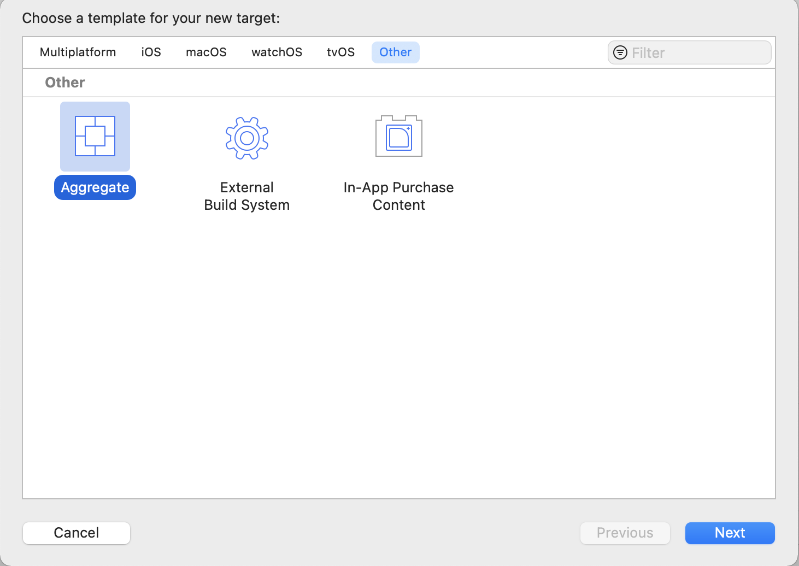
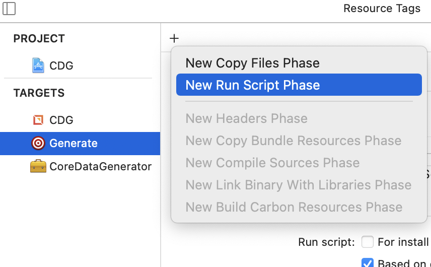

<!-- PROJECT LOGO -->
<p align="center">
  <a href="https://github.com/lotusflare/lfos-cdg">
    
  </a>
</p>

[![MIT License][license-shield]][license-url]
[![LinkedIn][linkedin-shield]][linkedin-url]
[![Contributors][contributors-shield]][contributors-url]
[![Issues][issues-shield]][issues-url]
# Core Data Generator

- [Introduction](#introduction)
  - [Features](#features)
  - [Supported platforms](#supported-platforms)
- [Installation](#installation)
- [CDG Setup](#cdg-setup)
  - [RepositoryType](#repositorytype)
  - [ModelType](#modeltype)
  - [DataStoreVersion](#datastoreversion)
  - [MigrationPolicy](#migrationpolicy)
- [Basic Usage](#basic-usage)
  - [Mark model as ManagedObject](#mark-model-as-managedobject-using-annotations)
  - [Save data to CoreData](#save-data-to-coredata)
- [Additional Features](#additional-features)
  - [Additional annotations for more advanced options](#annotations)


## Introduction

Core Data Generator (CDG for short) is a framework for generation (using [Sourcery](https://github.com/krzysztofzablocki/Sourcery)) of Core Data entities from plain structs/classes/enums. It also provides common storage operations (insertion, deletion, fetching, sorting, filtering) out of the box on the plain models themselves, without having to directly interface with Core Data at any point.

### Features

 - [x] Generating Core Data entities from plain structs/classes/enums
 - [x] Out-of-the-box functions/methods for inserting, fetching, updating, deleting, sorting and filtering of data without writing a single line of code
 - [x] Opaquely interfacing with Core Data under the hood, while you simply work with original plain models to perform all database-related actions
 - [x] Support for value types (structs/enums)
 - [x] Support for enums with associated values
 - [x] Automatic resolving of relationships between entities
 - [x] Keypath-based predicates for sorting/filtering which provides type safety
 - [x] Versioning and migrations of Core Data models
 - [x] Accessing underlying Core Data stores and generated managed objects for advanced usage

### Supported platforms

 - [x] iOS (minimum 11.0)
 - [x] macOS (minimum 10.13 High Sierra)

## Installation

Core Data Generator installation consists of two parts:
1. Integrating the `CoreDataGenerator` framework
1. Setting up [Sourcery](https://github.com/krzysztofzablocki/Sourcery) to run against the CDG code generation template.

### Integrating the framework

#### Using CocoaPods (**RECOMMENDED**)

It is recommended to use CocoaPods to integrate CDG into your project, because CocoaPods can also bundle the code generation Sourcery template file for you automatically, so you don't need to do it yourself.

To integrate the `CoreDataGenerator` framework in your Xcode project using CocoaPods, add the following to your `Podfile`:

```ruby
pod 'CoreDataGenerator', '~> 1.0'
```

#### Using Carthage

To integrate the `CoreDataGenerator` framework in your Xcode project using Carthage, add the following to your `Cartfile`:

```
github "https://github.com/lotusflare/lfos-cdg" ~> 1.0
```

#### Using Swift Package Manager

To integrate the `CoreDataGenerator` framework in your Xcode project using Swift Package Manager, add the following to your `Package.swift`:

```swift
dependencies: [
    .package(url: "https://github.com/lotusflare/lfos-cdg", .upToNextMajor(from: "1.0.0"))
]
```

### Setting up Sourcery

In addition to integrating the framework in your project, you will also need to setup a code generation target using [Sourcery](https://github.com/krzysztofzablocki/Sourcery). If you are unfamiliar with Sourcery, make sure to read the readme on how to install it. 

After having installed Sourcery, you will need to add the Sourcery configuration file and a code generation target to your Xcode project. 

#### Setting up the Sourcery configuration file

The Sourcery configuration file is a YAML file which instructs Sourcery on where to find the Core Data Generator template file, and where to output the generated Swift source code.

> This guide assumes that you will place the `sourcery.yml` file in your `${SRCROOT}` folder of the project.

#### Example `sourcery.yml` file (if you integrated the framework via CocoaPods)
```
sources:
  - ${SRCROOT}/YourProjectName
templates: 
  - ${PODS_ROOT}/CoreDataGenerator/CoreDataGenerator/CoreDataGenerator/Templates 
output: 
  path: ${SRCROOT}/YourProjectName/Generated/
  link: 
    project: ${SRCROOT}/YourProjectName.xcodeproj
    target: YourTargetName
```

#### Example `sourcery.yml` file (if you integrated the framework via Carthage or Swift Package Manager)

```
sources:
  - ${SRCROOT}/YourProjectName
templates: 
  - ABSOLUTE_PATH_TO_FOLDER_CONTAINING_FRAMEWORK/CoreDataGenerator.framework/ 
output: 
  path: ${SRCROOT}/YourProjectName/Generated/
  link: 
    project: ${SRCROOT}/YourProjectName.xcodeproj
    target: YourTargetName
```

#### Setting up the code generation Xcode target

Select your project in Xcode, click the `+` button in the lower left corner of the project inspector, and select the `Other -> Aggregate` template for the target.



> This guide recommends that you name the newly created target `Generate`.

Once you have created the target, select it and switch to the `Build Phases` tab. 

Click the `+` button on the top left, and select the `New Run Script Phase` option.



> If you've integrated the `CoreDataGenerator` framework via CocoaPods, you must also copy the `PODS_ROOT` variable from your main target to the `Generate` target. You can find this property under the  `Build Settings` tab, on the bottom of the list, under the `User-Defined` section.

Set the following as the script (assuming you have installed Sourcery successfully and it is in your `PATH`):
```
sourcery --config ${SRCROOT}/sourcery.yml --verbose
```

> If you have installed Sourcery via CocoaPods, and it is not in your `PATH`, you will need to put this instead:
> ```
> $PODS_ROOT/Sourcery/bin/sourcery --config ${SRCROOT}/sourcery.yml --verbose
> ```


#### Testing the setup

To test and make sure that the setup is completed successfully, run the `Generate` target. It should produce the output and you should be able to see the following two newly generated files in your project structure:


## CDG Setup

Before we go ahead and use CDG we need to setup some things first. 
To setup CDG the static method `CoreData.setup()` should be called.
This will load all generated `NSEntityDescription` entries for managed models.

```swift
CoreData.setup()

// We can pass a custom configuration. This is an optional step, if the custom configuration is not set the default one will be used.
let configuration = CoreDataConfig(repositoryType: .sqlite, modelType: .name("TestApp"), migrationPolicy: .recreateStoreOnHeavyWeightMigration)
CoreDataStore.shared.setup(with: configuration)
```

#### RepositoryType
CDG supports two repositoryTypes.
- `sqlite`
- `inMemory`

The `sqlite` case will create and store the data in the `sqlite` db.


The `inMemory` case will hold the data in the graph in RAM.

#### ModelType
There are two options for model type.
- `name`
- `defaultModel`

The `name` case represents the name under which the SQLite db will be created. 

The `defaultModel` case will set the default name for the db that will be extracted from `infoDictionary`

### DataStoreVersion
We can create different versions of the CoreData model. To add a version just extend the `DataStoreVersion` enum with a static constant.

```swift
extension DataStoreVersion {
    /// sourcery: targetModelVersion
    public static let v100 = ModelVersion(major: 1, minor: 0, patch: 0)
}
```
Note that the annotation `/// sourcery: targetModelVersion` is set. The annotation must be set only to one version, as the name suggests it will target the version that should be used.

### MigrationPolicy

CDG supports two different migration options.
- `recreateStoreOnHeavyWeightMigration`
- `resolveMigrationManually`

The `recreateStoreOnHeavyWeightMigration` case will recreate the store, meaning that any previously present store will be deleted, and an empty one will be created.

The `resolveMigrationManually` case, as the name suggests, is used for resolving migrations manually. When this option is in use we also must provide the mapping model so the Core Data can know how to migrate the data.
For every version that is added a `CoreDataStore` for that version is created.
The instance can be found in `CoreDataEntity` like:
```swift
CoreDataEntity.coreDataStore_v200

```
And to set the mapping model for the version just set the `mappingModel` closure.

For example:
```swift
CoreDataEntity.coreDataStore_v200.mappingModel = { mappingModel in
    // Find the model
    let migrationModel = mappingModel
        .entityMappings
        .filter { $0.sourceEntityName == Migration.managedModelName }
        .first

    // Set the entity migration policy
    migrationModel?.entityMigrationPolicyClassName = MigrationEntityMigrationPolicy.className
}
```

## Basic Usage

### Mark model as ManagedObject using Annotations

There are only two annotations necessary for the generator to work:

* `ManagedObject`: Use this annotation with your class/struct/enum and a "mirror" class will be generated. The generated class is a subclass of `NSManagedObject` and alongside with declaring the properties of the new managed object, some additional functions will be created as well.

* `primaryKey`: Marks property as a primary key. Primary key is mandatory, each entity must have a property declared as a unique constraint.

### Usage

* Annotate your class/struct/enum using `/// sourcery: ManagedObject`.
* Annotate a unique identifier property using `/// sourcery: primaryKey`, so your generated entity has a unique constraint declared when generated.
* Use the template in `CoreData.stencil` with Sourcery to generate your Core Data managed objects and entity creation based on your own class/struct/enum models.
* For additional usage options, look at the [Additional Features](#additional-features) section.

> The property marked with the `primaryKey` annotation must be mutable (`var`). This is necessary in order to support the `autoId` annotation, which automatically sets an unique identifier for every object.

#### Basic example

Here's an example in which we manually set the unique identifier (primary key) of our `Person`.
```swift
/// sourcery: ManagedObject
struct Person {
    /// sourcery: primaryKey
    var id: String = UUID().uuidString
    let name: String
}
```

And here's one where we use the `autoId` annotation so that CDG takes care of setting an unique identifier for us:

```swift
/// sourcery: ManagedObject, autoId
struct Person {
    /// sourcery: primaryKey
    var id: String? = nil
    let name: String
}
```


### Save data to CoreData
We can insert a single row or a batch in CoreData.

#### Inserting a single row

```swift
let model = Person(name: "Josh")

model.createAndPopulate { result in
  switch result {
  case .success(let insertedElement):
    // Here we get inserted row
  case .failure(let error):
    // Handle failure
  }
}
```

#### Inserting a batch

```swift
let batch = [
              Person(name: "Josh")
              Person(name: "Merry")
              Person(name: "Matilda")
            ]
batch.createAndPopulate { result in
  switch result {
  case .success(let insertedElements):
    // Here we get all inserted rows
  case .failure(let error):
    // Handle failure
  }
}
```


### Generated Code

For your class/struct/enum that you have annotated with `ManagedObject`, an extension of it will be generated, conforming to the `Persisatble` protocol with the basic CRUD operations being implemented in the extension:

* `static func count(groupID: using predicate: sourceContext:) -> Int`
  * Retrieves a number of objects which can be fetched using predicate from context

* `static func get(entityID:sourceContext:) -> Self?`
  * Fetches a single instance of your type, based on the entity matching the `entityID`, by default from the main context, but a different one can be passed with `sourceContext` parameter.

* `static func get(groupID: using predicate: comparisonClauses: sourceContext:) -> [Self]`
  * Fetches multiple instances of your extended type, based on entities that meet the `predicate` conditions, defaultly from a main context, but different one can be passed with `sourceContext` parameter.

* `static func getAll(groupID: comparisonClauses: sourceContext:) -> [Self]`
  * Fetches all instances of your extended type, mapped from all entities, defaultly from a main context, but a different one can be passed with `sourceContext` parameter.

* `static func create(groupID: updateIfEntityExists: updateClosure: completeClosure:)`
  * Creates a `Persistable` entity on a background context on a `NSPersistentStore`, `updateClosure` is triggered on a background thread, passing a newly created object, or if it already exists, object to be updated.

* `static func createBatchAndPopulate<PersistableType>(groupID: from plainModels: insertionPolicy: completeClosure:)`: 

* `static func createEntity(groupID: entityID: context:) -> Self?`
  * Exclusively used to initialize relationship entities. This is used by CDG itself when resolving relationships, and shouldn't be used directly.

* `static func createTemporary(groupID: updateClosure:)`
  * Create a temporary object which will be persisted (does not trigger a context save).

* `func update(updateClosure: completeClosure:)`
  * Update the object using an update closure.

* `func delete(sourceContext: completeClosure: (() -> Void)?)`
  * Deletes an entity from a NSManagedObjectContext specified by `sourceContext` parameter.

* `static func delete(with options: DeleteOptions, completeClosure: (() -> Void)?)`
  * Deletes a collection of entity results fetched by predicate condition defined in `options`.

* `static func getAllGroups(sourceContext:) -> [String]?`
  * Fetches all groups associated with this entity that exist in the database.

## Additional Features

### Annotations

Here is the overview of other available annotations that can be used:

* `autoId`: Creates the unique primary key and assigns it to the property annotated with "primaryKey".
* `relationshipIdentifier`: Specifies name of the property which defines identifier(s) that are used to resolve the relationship.
* `relationshipName`: Sets the name of the relationship property in the generated managed entity class.
* `managedPropertyName`: Defines the name of this property in the generated CoreData entity managed class. Useful for mitigating issues with already defined properties in the generated managed class (since the managed class extends `NSObject`), for example when having a `description` property in the original model struct, it can be renamed to `managedDescription` or something else to avoid conflicts with the `NSObject`'s `description` property.
* `indexed`: A value that indicates whether the receiver should be indexed for searching.
* `relationshipDeleteRule`: Specify your own relationship delete rule, default one is set by ...
* `recursive`: Annotation should be set on properties that cause recursion. Example: `A` has a reference to `B` and `B` has a reference to `A`.
* `targetModelVersion`: This will tell the CDG what is the latest version of data store.

<!-- MARKDOWN LINKS & IMAGES -->
<!-- https://www.markdownguide.org/basic-syntax/#reference-style-links -->
[linkedin-shield]: https://img.shields.io/badge/linkedin-gray?style=for-the-badge&logo=linkedin
[linkedin-url]: https://www.linkedin.com/company/lotusflare
[license-shield]: https://img.shields.io/badge/License-gray?style=for-the-badge
[license-url]: https://github.com/lotusflare/lfos-cdg/blob/master/LICENSE
[issues-shield]: https://img.shields.io/badge/Issues-red?style=for-the-badge
[issues-url]: https://github.com/lotusflare/lfos-cdg/issues
[contributors-shield]: https://img.shields.io/badge/Contributors-gray?style=for-the-badge
[contributors-url]: https://github.com/lotusflare/lfos-cdg/graphs/contributors
